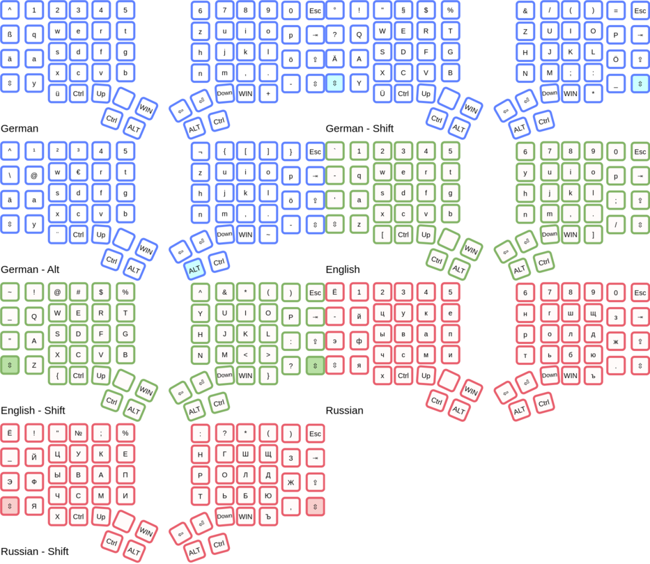

# Dacty - split keyboard with unified layouts

## Clone

```bash
git clone https://github.com/maxistar/dacty.git
cd dacty
```

## Related Projects

- Corney: https://github.com/maxistar/corney

## Layout Helper

Use Keyboard Layout Helper to inspect and tune layers visually:
https://projects.maxistar.me/keyboard_helper/

## Prerequisites

- [Node.js](https://nodejs.org/) (LTS)

## Setup

```bash
cd dacty
npm install
```

## Generate stickers

```bash
node legends/index.js
```

Outputs `legends/stickers_a4.png` — a 600 DPI A4 sticker sheet ready for a print shop (CMYK TIFF).

## Unified Layouts

Before:



After:


